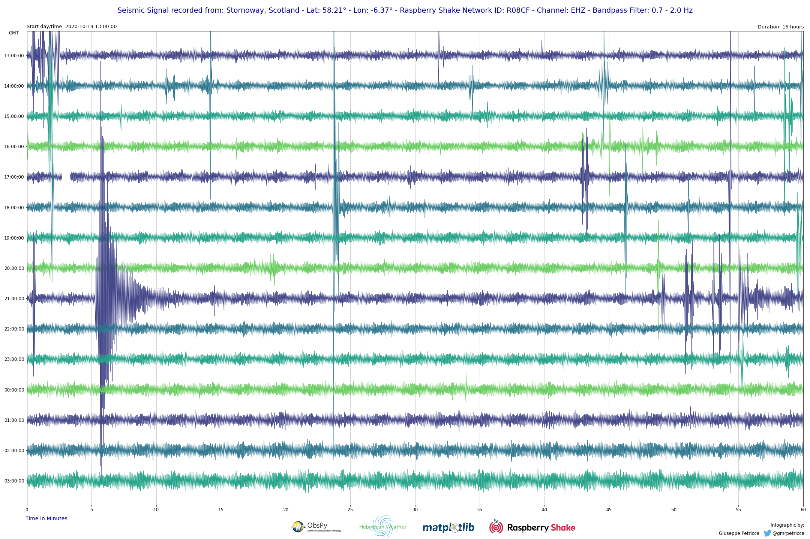
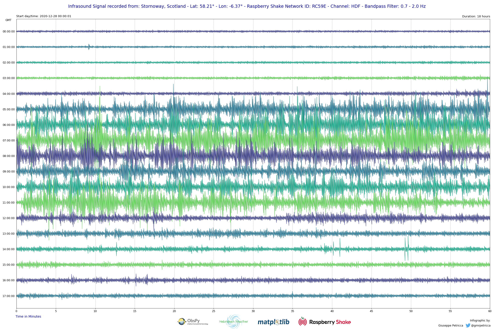

# Seismic Infrasound Data Daily Plotter
### Read data from an online FDSN client and produce a daily plot with user-defined variables and perceptually uniform sequential colormaps.

*Coded by Giuseppe Petricca (@gmrpetricca)*

[](https://github.com/raspishake/rsudp/blob/master/LICENSE)

An extension to the classic [Obspy One Day Plot](https://docs.obspy.org/tutorial/code_snippets/waveform_plotting_tutorial.html) with more customisable options.

As it is possible to see from the two plots below, this script can be used with any station channel [EHZ, EHN, EHE, SHZ, ENZ, ENN, ENE], even the infrasound one [HDF].





Required software and packages:
- Python 3
- Jupyter
- Matplotlib
- Numpy
- Obspy

Installation via Anaconda:
```bash
# install the environment with the correct software:
conda create -n dailyplotter python=3 jupyter jupyterlab matplotlib numpy obspy
# activate the environment
conda activate dailyplotter
# navigate to the folder where you have the Python code via command prompt
cd -local address of the Python folder-
# start Jupyter Lab
jupyter lab
```
Once this is done, it is possible to open the `DailyPlotter.ipynb` file in the repository.

The process and file are commented throughout the various steps, however, this is a brief guide on how to use them: 
1. The first marked section is for the user to complete, entering all the relative station information. They will be used to download the data and produce the plots.
2. The data is automatically filtered with a Bandpass Filter from 0.7 Hz to 2.0 Hz. To change this, the section ```# define details for the filter``` (`line 29`) is the one to check. To disable the filtering, comment `line 50` of the `DailyPlotter.ipynb` file.
3. Once the station data has been input, change the `record_start` and the `time_length` variables to set the starting date/time and the lenght of the plot (it is recommended to not plot more than 72-84 hours in one setting, to avoid too much track overlap).

Done!

Extra: if you have one, you can add your personal logo center low (in place of the `Hebridean Weather` one) by putting it in the `img` folder and modifying its address on `lines 98-99` of the the `DailyPlotter.ipynb` file.

Extra 2: to change the tones of the colormap, or the entire colormap, the lines to modify are the following: `lines 59-60-71`.

Extra 3: if the amplitude of the plotted waveforms is too big (or too small), it is possible to modify the scaling of the plot in the section marked as `# select appropriate scaling range based on channel` at `line 73`.
